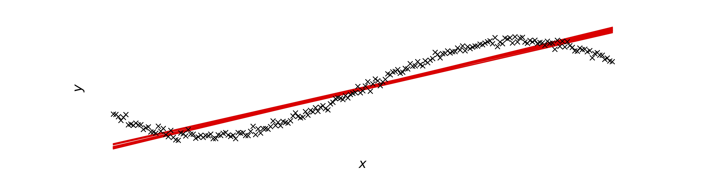
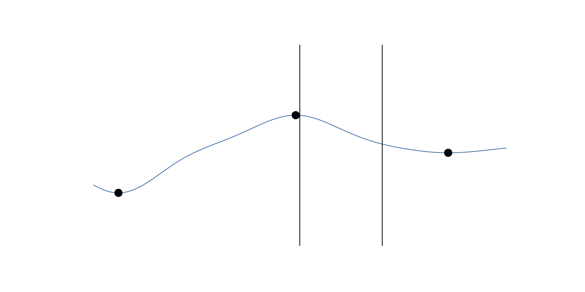
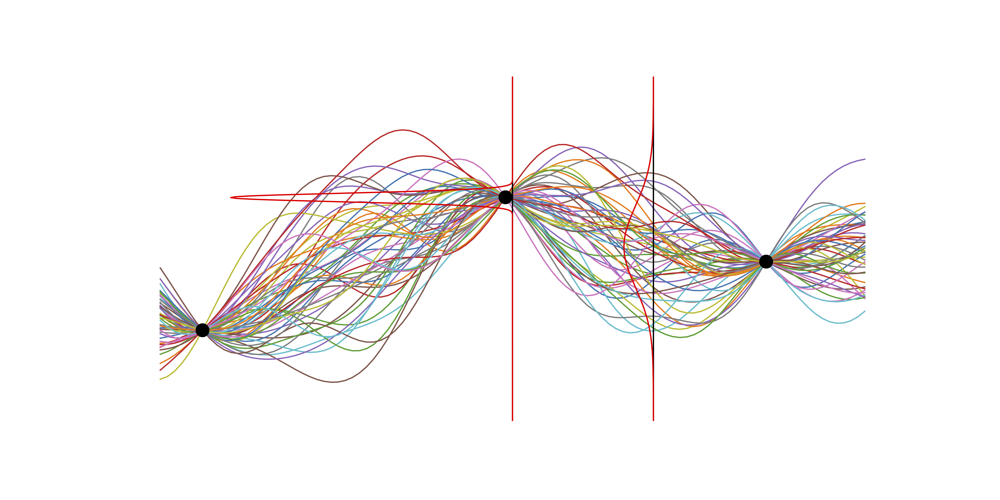
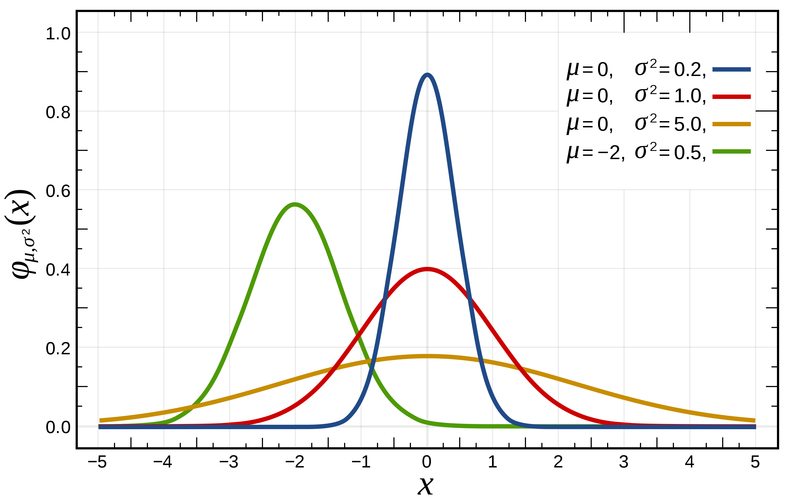

+++
title = "Bayesian Machine Learning"
author = ["Aidan Scannell"]
date = 2020-01-12T20:01:00+00:00
tags = ["machine-learning", "bayesian-inference", "probabilistic-modelling"]
draft = false
+++

In this post I want to introduce the main concepts in Bayesian machine learning.
I could have also called this post "Bayesian Inference" or "Probabilistic Modelling and Approximate Inference" as the terms seem to be used interchangeably.
Anyway, it took me a while to understand some of the concepts in Bayesian ML and how they link together, so I am hoping that this post explains the key concepts and links them together in an easy to understand way.
I've decided to walk through what I believe are the main concepts and I introduce simple examples to help explain some of the concepts.
Bayesian inference plays a key role in my research so I really hope that I have picked up some useful intuitions that can help others in their pursuit of Bayesian mastery.

Lets start from the beginning and give a definition for machine learning.
We can view machine learning as the science of learning models from data.
This is achieved by defining a space of models and then learning the parameters and the structure of the models from data.
We can then use our learned model to make predictions and decisions.

Uncertainty is fundamental in the field of machine learning and arises from working with incomplete or imperfect information.
In machine learning we often want to learn predictive models that map inputs to an output, a continuous variable in regression or a discrete class label in classification.
There are multiple sources of uncertainty that ideally we would like to know and thus should attempt to model.
[This blog post by Jason Brownlee](<https://machinelearningmastery.com/uncertainty-in-machine-learning/>)
gives a great introduction to uncertainty in machine learning and I would encourage reading it if this is a new concept for you.
Here's a quick overview of the main sources of uncertianty.

## Noise in Data (Aleatoric Uncertainty) {#noise-in-data--aleatoric-uncertainty}

This type of uncertainty refers to variability in the observations.
It can arise from the data having natural variations or from the measurement process intorducing variations/noise.
The figure below shows a dataset with regions of low and high noise.

## Incomplete Coverage of the Domain (Epistemic Uncertainty) {#incomplete-coverage-of-the-domain--epistemic-uncertainty}

Observations used to train a model are just samples from the true distribution and thus are incomplete.
The figure below shows a set of functions fit to some observations (training data).
Around the observations all of these functions are very similar but as we move away from the observations we can no longer be certain which function is correct.
This is known as epistemic uncertainty and in the limit of infinte data it is compeltely reduced.



## Imperfect Models {#imperfect-models}

In machine learning we specify a class of models that we use to represent observations from a system.
We have to use our knowledge of the system to specify this restricted set of models and the mismatch between these and all possible models introduces uncertainty.
The figure below shows a crude example where we have restricted the model class to linear functions even though the data was generated by a composite function consisting of both a linear function and a sinusoidal function.


## Uncertainty in Machine Learning {#uncertainty-in-machine-learning}

Uncertainty is present in all machine learning models (and also inference) but only some techniques provide a principled way to model it.
For example, imagine we have a neural network with uncertainty from incomplete coverage of the domain.
If we attempt to make a predcition for an input that does not lie in the training distribution then our model cannot be confident in its predicition, especially if it is really far away.
Neural networks have no mechanism for modelling this and as a result cannot inform us of when they are uncertain.

Lets illustrate this for a simple 1D regression problem consiting of 3 data points.
The figure below shows a function fit to such a dataset; this is representative of what would happen with a neural network i.e. they represent a deterministic function.

If we want to make predictions (at locations shown by the black lines) then our learned function will return the corresponding point predictions.
Great, we did some machine learning and made some predictions!
Now, which prediction is the model more certain about?
Probably the one closest to the middle data point.
Many ML models do not have the capability to provide a notion of uncerainty in their predictions.
Should we then, be trusting these models in safety critical or high risk applications?
Probably not...

Lets now consider more of the possible functions that could be fit to the dataset.
The figure below illustrates this.


      

It also shows the notion of probabilistic predictions, that is, returning a probability distribution over the predicted output, as opposed to a point prediction (like the previous example).
In this example each prediction is represented by a Gaussian (normal) distribution.
This distribution is goverend by two parameters; mean \\(\mu\\) and variance \\(\sigma\\) (or standard deviation \\(\sigma^2\\)).
Their effect on the probability density function is illustrated below.


      

Now that we can see how the parameters govern the distribution, lets return to our probabilistic prediction.
The mean corresponds to the point prediction achieved in the deterministic example i.e. what would be output by a neural network.
We now also have the variance of the Gaussian distribution which provides us with a notion of uncertainty; lower variances correspond to being more certain.
This extra value is extrememly useful, it can be used for decision making, intelligent data collection and much much more.
In settings like helthcare we now know if we can trust our model or if we should ask a human expert.

> I wanted to mention this example to justify why we may want probabilistic predictions from our models.
  This example is noise free Gaussian process regression and if you are interested in how we can do this in neural networks check out the field of Bayesian neural networks.

We've spoken about what uncertainties we would like to model and how probabilistic predicitons provide information regarding how certain we are.
How then, do we construct models capable of handling these uncertainties and providing probabilistic predictions?

Probability theory is a filed of mathematics designed to handle and harness uncertainty.
In probabilistic modelling the model describes data that can be observed from the system.
If we use probability theory to express all forms of uncertainty in our model, then we can use Baye's rule to infer unknown quantities, adapt our models, make predictions and learn from data.
Bayesian inference provides a principled framework for modelling uncertainty through the use of probability theory.

Before introducing Bayesian inference it is important to first understand Baye's rule.

## Baye's Theorem {#baye-s-theorem}

I have to say, Baye's theorem is pretty cool!
It allows us to use any knowledge or belief that we already have about a system to help us calculate the probability of an event.
For example, if we wanted to find the probability of a coin toss being heads, Baye's rule gives us the tools to use our prior knowledge of the likelihood of the coin toss being heads.
We'll be going into more detail throughout the post but for now all you need to know is that Baye's theorem allows us to update the probability of a hypothesis as we receive more evidence or information.
Mathematically Baye's theorem is defined as,

\\[
P(hypothesis | data)=\frac{P(data |hypothesis) P(hypothesis)}{P(data)}.
\\]
Mathematical definitions can often be hard to understand without an example so we will get stuck into an example from a ML point of view.

## The Model {#the-model}

Lets assume that we have observed a system with a binary outcome (e.g. a coin toss).
We denote a single observation from the system as \\(x \in \\\{0, 1\\\}\\), that is, \\(x\\) can either take the value \\(0\\) (heads) or the value \\(1\\) (tails).

Being Bayesian we would like to model observations from this system using probability distributions.
The first thing we need to specify is our likelihood and it should tell us how likely an observation is given the parameterization of the system, i.e. \\(p(x | \theta)\\).
Here \\(\theta\\) represents our model parameters.
For a binary system such as this, it makes sense to use a Bernoulli distribution as the likelihood,
\\[
p(x | \theta) = p(x | \mu) = \text{Bern}(x | \mu) = \mu^{x} (1 - \mu)^{1-x}.
\\]
The Bernoulli ditribution is parameterised by a single parameter \\(\mu\\).
The reason we have picked this distribution is because it makes sense to parameterize the system using a single parameter \\(\mu\\) that conatins information regarding how often we observe each outcome i.e. how biased is the coin.
\\(\mu\\) is the probability of getting a tails and \\(1-\mu\\) is the probability of getting a heads.
If we think the coin is fair then we would initially guess \\(\mu=0.5\\) and if we thought it was biased towards heads then maybe \\(\mu=0.3\\).

Lets now look at the value of our likelihood for each of our possible observations to get some intuition for what is going on,
\\[
p(x=0 | \mu) = \mu^{0} (1 - \mu)^{1-0} = 1 - \mu
\\]
\\[
p(x=1 | \mu) = \mu^{1} (1 - \mu)^{1-1} = \mu
\\]
So what is this telling us?
Well, if we think the coin is biased towards heads then we might set \\(\mu=0.3\\).
Remember our likelihood should return a probability value between \\(0\\) and \\(1\\), where \\(1\\) means the observation was very likely and \\(0\\) means very unlikely.
If we observe a heads \\(x=0\\) then our likelihood \\(p(x=0 | \mu)\\) should return a value \\(>0.5\\).
Lets calculate the likelihood of each possible observation given the parameter settting \\(\mu=0.3\\),
\\[
p(x=0 | \mu=0.3) = 0.3^{0} (1 - 0.3)^{1-0} = 1 \times (1 - 0.3) = 0.7
\\]
\\[
p(x=1 | \mu=0.3) = 0.3^{1} (1 - 0.3)^{1-1} = 0.3 \times 1 = 0.3
\\]
The results are as expected so our choice of likelihood is good!
We can extend our likelihood for \\(N\\) observations (coin tosses) \\(\mathbf{x} = \\\{ x\\_n \\\}\_{n=1}^N\\),

\\[
p(\\mathbf{x} | \\mu) = \\prod\\_{n=1}^N \\mu^{x\_n} (1 - \mu)^{1-x\\_n}
\\]
where we have made the assumption that each coin toss is independent.
This is why we have multiplied the likelihood for each individual coin toss.
For a given parameter setting we now have a method for caclulating how likely our dataset is given our model.

If we know the parameters of our system, in this case \\(\mu\\), then we can generate output that is similar to the actual system using the likelihood.
That is, we can make predictions!
What we would like to do then, is learn the value of \\(\mu\\) from observations of the actual system.

> One obvious way to do this is to perform maximum likelihood estimation.
That is, set the parameter \\(\mu\\) to the value that maximizes the likelihood,
\\[
  \mu = \underset{\mu}{\text{argmax}}\ p(\mathbf{x} | \mu).
\\]
Hopefully you can see how this is quite an intuitive thing to do.

## The Prior Distribution {#the-prior-distribution}

However, in order to use Baye's rule we need to specify a prior belief about the parameters in our model, in this case just \\(\mu\\).
What prior knowledge do we have about our system?
Well, most coins that one comes across are not biased and the value of \\(\mu\\) is \\(0.5\\).
Now we just need to incorporate this knowledge to specify a prior distribution over \\(\mu\\).
Then we can just use Baye's rule to reach the posterior of the parameters given the data,

\\[
p(\mu | x) = \frac{p(x|\mu) p(\mu)}{p(x)}.
\\]

How then, does one pick the distribution for the prior?
If we specify either our prior or likelihood wrong then this computation may not even be analytically tractable.
Because of the integral in the denominator \\(p(\mathbf{x}) = \int p(\mathbf{x}| \mu) p(\mu) \text{d}\mu\\).
When this is the case we resort to approximations, with the main methods being Monte Carlo (sampling) and variational inference.

Luckily, we can exploit something known as conjugacy.
In Bayes rule, if the posterior distribution \\(p(x | \mu)\\) is in the same probability distribution family as the prior distribution \\(p(\mu)\\), then they are called conjugate distributions.
The prior is also called the conjugate prior to the likelihood function.

> It is important to note that the form of the conjugate prior depends on what parameter from the likelihood distribution is unknown and thus being learned.
For example, if we have a Gaussian likelihood where we known the mean and want to infer the variance from data, then the conjugate prior distribution is inverse gamma.
However, if the variance was known and we wanted to infer the mean, then the conjugate prior distribution would be Gaussian.

Why do we care about this?
Well, if both the prior and the posterior are from the same probability distribution family, then we don't need to calculate the denominator of Baye's rule (the evidence).
We can simply multiply the prior and the likelihood and identify the parameters of the posterior (as we know its form).
It's not important to know how to determine conjugate priors as mathematicians do it for us (and put them on [Wikipedia](<https://en.wikipedia.org/wiki/Conjugate%5Fprior>) :laughing:).

## Bayesian Inference {#bayesian-inference}

Inference refers to the process of learning the parameters of a model.
It is important to remember that a model is seperate to how you train it.
If we consider deep learning, you usually train the network weights (parameters) using an optimizer such as Adam or RMSProp or any other optimizer (usually being a variant of stochastic grdient descent).

Bayesian methods of inference consist of both deterministic and stochastic approaches.
The most important methods being Monte Carlo (sampling) methods and variational inference.

In machine learning, our goal is to infer \\(\theta\\) from the data and then make predicitions using our learned model.
The predicition will vary depending on the type of task (classification, regression, clustering, etc) but understanding how we make predicitions is key to understanding why we care about modelling a distribution over the model parameters.
If we have a set of observed data \\(\mathcal{D} = \\\{\mathbf{x}, \mathbf{y}\\\}\\) (supervised learning) and have parameterized a model with parameters \\(\pmb\theta\\), then we wish to obtain the posterior over the parameters,

\\[p(\mathbf{\theta}|\mathcal{D}) = \frac{p(\mathcal{D}|\mathbf{\theta})p(\mathbf{\theta})}{p(\mathcal{D})},\\]
so that we can make predicitions,
\\[
p(\mathbf{y}\\_\\*| \mathbf{x}\\_\\*, \mathcal{D}) = \int p(\mathbf{y}\\_\\* | \mathbf{x}\\_\\*, \theta, \mathcal{D}) p(\theta | \mathcal{D}) \text{d} \theta,
\\]
where \\(\mathbf{x}\\_\\*\\) is a previously unseen test input and \\(\mathbf{y}\\_\\*\\) is its corresponding output value.

Hopefully from this equation it is clear why we seek a posterior distribution over the parameters.
It is because we would like to make probabilistic predictions that capture how certain we are in our prediction.
We have modelled our uncertainty by representing our parameters as probability distributions as opposed to single values.
In this equation we are essentially calculating the expectation of the prediction function \\(p(\mathbf{y}\\_\\* | \mathbf{x}\\_\\*, \theta, \mathcal{D})\\) under the posterior distribution of the parameters \\(p(\theta | \mathcal{D})\\),
i.e. we are calculating the prediction for different parameter settings and weighting them according to how likely we think each particular parameter setting is.

This is very cool when you think about it!

<!-- In Bayesian inference we seek to update a statistical hypothesis (our prior distribution \\(p(\mathbf{\Theta})\\)) when we observe data \\(\mathcal{D}\\). Bayesian inference derives the posterior probability \\(p(\mathbf{\Theta}|\mathcal{D})\\) from the prior probability \\(p(\mathbf{\Theta})\\) and the likelihood function \\(p(\mathcal{D}|\mathbf{\Theta})\\) (a statistical model for the observed data) using Bayes rule, -->

Both learning and predicition can be seen as forms of inference

## Evidence {#evidence}

In maximum likelihood estimation we seek to find the best model parameters by maximising the likelihood \\(p(\mathbf{Y} | \mathbf{\Theta})\\).
We obtain a point estimate for the "best" parameters \\(\mathbf{\Theta}\\).
The likelihood function is higher for more complex model structures which leads to overfitting.

Bayesian methods overcome overfitting by treating the model parameters as random variables (as we have shown previosly) and maximising the logarithm of the marginal likelihood (or evidence) \\(p(\mathbf{Y})\\),

\begin{align}
	\text{log}\ p(\mathbf{Y}) &= \text{log} \int p(\mathbf{Y}, \mathbf{\Theta}) \text{d}\mathbf{\Theta} = \text{log} \int p(\mathbf{Y} | \mathbf{\Theta}) p(\mathbf{\Theta}) \text{d}\mathbf{\Theta}.
\end{align}

This is advantageous as we now consider all parameter \\(\mathbf{\Theta}\\) settings and we obtain the posterior \\(p(\mathbf{\Theta} | \mathbf{Y})\\) for the unknown parameters, as opposed to just a point estimate as in maximum likelihood estimation. This provides automatic Occam's razor, penalising complex models and preventing overfitting.

Often the posterior is not analytically tractable due to the integral,

\\[p(\mathcal{D}) = \int p(\mathcal{D}|\mathbf{\Theta})p(\mathbf{\Theta}) d\mathbf{\Theta},\\]

however, in the case of a Gaussian likelihood and a Gaussian process prior, the posterior takes the form of a Gaussian process over functions and is analytically tractable (hurray!).

The denominator is known as the marginal likelihood (or evidence) and represents the probability of the observed data when all of the assumptions have been propagated through and integrated out,

\\[
p(\mathbf{Y}) = \int p(\mathbf{Y}, \pmb\theta) d\theta.
\\]
Sometimes this integral is intractable (computationally or analytically) so we cannot exploit conjugacy to avoid it's calculation. For this reason we have to make approximations to this integral.

MacKay plot



## Regression Example {#regression-example}

Lets assume that we have observed some inputs \\(\mathbf{X}\\) and targets \\(\mathbf{Y}\\) and collected them into a data set \\(\mathcal{D} = \\\{\mathbf{X}, \mathbf{Y}\\\}\\). In regression we seek to learn the mapping \\(f\\) from our observed data. We do this by constructing a model of the mapping that contains parameters (or hyper-parameters in the non-parametric case) \\(\mathbf{\Theta}\\) that we want to learn from our data. As we wish to take uncertainty into account we are interested in obtaining the posterior over these parameters (representing the mapping) given the observations \\(p(\mathbf{\Theta}|\mathcal{D})\\).

In the Bayesian regression setting we are seeking to make predictions \\(p(\mathbf{y}|\mathbf{x}\\_\\*)\\). That is, not only do we want the value of \\(\mathbf{y}\\_{\\*}\\) corresponding to a previously unseen input but we also want to know how certain we are in our predicition.

If you are interested in

WE can
