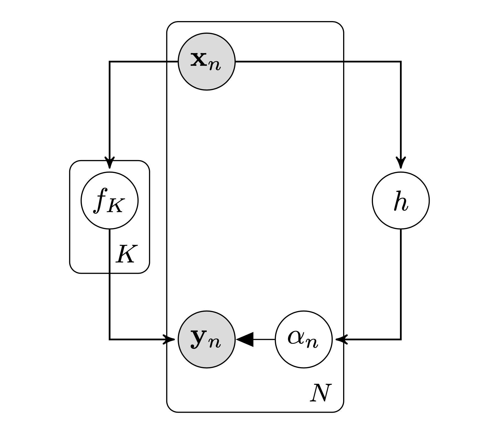

We present an approach for separating low and high noise regimes in Gaussian process dynamics models. 
We assume that our data is generated by the same underlying process with noise added from one of two modes, where the noise in one mode is much larger compared to the other. 
Our model separates these two regimes using a Riemannian manifold parameterised as a Gaussian process. 
As such, we are able to specify a prior distribution over this *change* manifold, providing a mechanism for encoding our expert domain knowledge regarding the separation of the two regimes in input (state) space. 
It also explicitly quantifies the uncertainty in the location of the manifold. 
This model was developed for application to drone operations in self induced turbulence and seeks to provide a method for both modelling and learning a separation between stable and unstable regimes.

## Problem Statement
In this work we consider dynamical systems,

\begin{equation}
    \mathbf{s}_t = f(\mathbf{s}\_{t-1}, \mathbf{a}\_{t-1}),
\end{equation}

with continuous states $\mathbf{s} \in \mathbb{R}^D$ and actions $\mathbf{a} \in \mathbb{R}^F$ and unknown nonlinear transition dynamics $f$. We assume that the transition dynamics $f$ consists of two regimes $\{f\_1, f\_2\}$,

\begin{equation}
    f = \begin{cases}
      f_1 = g + \epsilon\_1,\newline
      f_2 = g + \epsilon\_2 
    \end{cases}
\end{equation}
where $\epsilon\_i \sim \mathcal{N}(0, \Sigma\_{i})$ and $\epsilon\_1 \gg \epsilon\_2$ i.e. the noise in one mode is much larger compared to the other. 

## Our Model
For notational conciseness we will denote an individual input $(\mathbf{s}\_{t-1}, \mathbf{a}\_{t-1})$ as $\mathbf{x} \in \mathbb{R}^{D+F}$ and its corresponding output $\mathbf{s}\_t$ as $\mathbf{y} \in \mathbb{R}^{D}$. 
Our proposed model assumes that a latent function $g$ generates $N$ pairs of observations with Gaussian noise added from one of the two modes, resulting in the data set $\mathcal{D} = \{(\mathbf{x}\_n, \mathbf{y}\_n)\}\_{n=1}^N$. 
The assignment of the $n^{\text{th}}$ data point is specified by the variable $\alpha_n \in \{0, 1 \}$. 
The model assumes that an implicit Riemannian manifold $h$ parameterised as a Gaussian processs separates the two regimes. 
The output of $h$ determines the assignment $\alpha_n$ by passing its output through the probit function. The figure below shows the graphical model of the generative process.

We denote all of the $N$ inputs $\mathbf{X} = \[\mathbf{x}_1, ..., \mathbf{x}_N\]$, all of the targets $\mathbf{Y} = [\mathbf{y}\_1, ..., \mathbf{y}\_N]$ and all of the assignments $\pmb{\alpha} = \\{ \alpha\_1, ..., \alpha\_N \\}$. The value of the latent function $g$ associated with the $n^{\text{th}}$ input is denoted as $\mathbf{g}\_n = g(\mathbf{x}\_n)$ and collected into $\mathbf{G} = \\{ \mathbf{g}\_1,...,\mathbf{g}\_N \\}$ for all data points. Similarly for the latent function $h$ the values $\mathbf{h}\_n = h(\mathbf{x}\_n)$ are collected as $\mathbf{H} = \\{ \mathbf{h}\_1,...,\mathbf{h}\_N \\}$. The likelihood of our model takes the form,
\begin{equation}
	p(\mathbf{Y} | g, \pmb{\alpha}) = {\displaystyle \prod_{n=1}^{N}} \mathcal{N}	(\mathbf{y}_n|g, \epsilon_1)^{\alpha_n} \mathcal{N}	(\mathbf{y}_n|g, \epsilon_2)^{1 - \alpha_n},
\end{equation}
and we place a GP prior on the latent function $g$,
\begin{equation}
	p(g | \mathbf{X}) = \mathcal{N}(g|\mathbf{0}, k_g({\mathbf{X},\mathbf{X}})),
\end{equation}
where $k_g(\cdot, \cdot)$ represents the squared exponential kernel with automatic relevance determination.

We assume that there is a relationship between our assignments $\alpha_n$ and the input space $\mathbf{x}$ such that we can separate the assignments according to an implicit Riemannian manifold. Placing a GP prior on this manifold means that we can encode our prior knowledge of the associations by the choice of mean function. Our prior on the manifold takes the form,
\begin{equation}
	p(h | \mathbf{X}) \sim \mathcal{N}(h | \mu_h(\mathbf{X}), k_h(\mathbf{X}, \mathbf{X}))
\end{equation}
where $\mu_h(\cdot)$ represents the manifolds mean function and $k_h(\cdot, \cdot)$ represents the manifolds covariance function.
The output from the GP modelling the separation manifold needs to be constrained $\alpha_n \in [0, 1]$ and thus we define,
\begin{equation}
	p(\pmb{\alpha} | h) = \text{probit}(h).
\end{equation}
The full joint distribution of our model thus takes the form,
\begin{equation}
p(\mathbf{Y}, g, \pmb{\alpha}, h, \mathbf{X}) = p(\mathbf{Y} | g, \pmb{\alpha}) p(g | \mathbf{X}) p(\pmb{\alpha} | h) p(h | \mathbf{X}) p(\mathbf{X}) .
\end{equation}

### What are we trying to achieve?
We are interested in learning the dynamics GP $g$ and the separation manifold GP $h$ and thus need to obtain a posterior over $g$ and $h$.
We then wish to make predictions of the assignment $\pmb{\alpha}$ for a new input $\mathbf{x}\_\*$ and then select the relevant "mode" (currently defined by noise) and use it to predict $\mathbf{y}\_\*$.  

## Variational Approximation
Exact inference in our model is intractable and thus we require an approximation. We can compute a closed form Jensen's lower bound after expanding the GP priors using auxiliary inducing variables. As introduced in \cite{Damianou2015}, we can use these extra variables in the spare GP framework from \cite{Titsias2009}.

### What is Variational Bayesian Inference?

Suppose we have some observations $\mathbf{Y}$ generated from a family of models $p(\mathbf{Y}, \mathbf{\Theta})$, where $\mathbf{\Theta}$ represents the unknown random variables that the model depends on.

#### Maximum Likelihood
In maximum likelihood we seek to find the best model by maximising the likelihood $p(\mathbf{Y} | \mathbf{\Theta})$. We obtain a point estimate for the "best" variables $\mathbf{\Theta}$.

#### Type II MLE/MAP
Bayesian methods seek to maximise the logarithm of the marginal likelihood (or evidence) $p(\mathbf{Y})$,

$$
\begin{align}
	\text{log}\ p(\mathbf{Y}) &= \text{log} \int p(\mathbf{Y}, \mathbf{\Theta}) \text{d}\mathbf{\Theta} = \text{log} \int p(\mathbf{Y} | \mathbf{\Theta}) p(\mathbf{\Theta}) \text{d}\mathbf{\Theta}.
\end{align}
$$
This is advantageous as we now take a weighted average over all possible settings of $\mathbf{\Theta}$ and we obtain the posterior $p(\mathbf{\Theta} | \mathbf{Y})$ for the unknown variables, as opposed to just a point estimate as in maximum likelihood. This provides automatic Occam's razor, penalising complex models and preventing overfitting.

This integral is not always tractable and thus variational approaches are required. Variational approaches seek to lower bound the marginal likelihood (or evidence) $p(\mathbf{Y})$ using a functional that depends on variational parameters $q(\mathbf{\Theta})$.

$$
\begin{align}
	\text{log}\ p(\mathbf{Y}) &= \text{log} \int p(\mathbf{Y}, \mathbf{\Theta}) \text{d}\mathbf{\Theta} = \text{log} \int p(\mathbf{Y} | \mathbf{\Theta}) p(\mathbf{\Theta}) \text{d}\mathbf{\Theta} \newline
	&= \text{log} \int \frac{q(\mathbf{\Theta})}{q(\mathbf{\Theta})} p(\mathbf{Y}, \mathbf{\Theta}) \text{d}\mathbf{\Theta} \newline
	&= \text{log} \int q(\mathbf{\Theta}) \frac{p(\mathbf{Y}, \mathbf{\Theta})}{q(\mathbf{\Theta})} \text{d}\mathbf{\Theta} \newline
	&= \text{log} \mathbb{E}\_{q(\mathbf{\Theta})} \bigg[ \frac{p(\mathbf{Y}, \mathbf{\Theta})}{q(\mathbf{\Theta})} \bigg] \newline
	&\geq \mathbb{E}\_{q(\mathbf{\Theta})} \bigg[ \text{log} \frac{p(\mathbf{Y}, \mathbf{\Theta})}{q(\mathbf{\Theta})} \bigg]
\end{align}
$$

The bound becomes exact if $q(\mathbf{\Theta}) = p(\mathbf{\Theta} | \mathbf{Y})$. The true posterior is intractable but the variational posterior $q(\mathbf{\Theta})$ must be constrained (so that it is tractable). It is common to factorise $q(\mathbf{\Theta})$ with respect to groups of elements belonging to parameter set $\mathbf{\Theta}$, this is known as mean field approximation.

### Standard Mean Field Bayesian Inference in Our Model
A Bayesian treatment of our model requires the unknown random variables to be marginalised out: both the mapping values $\mathbf{G}$ and $\mathbf{H}$.

The integral we require is,

$$
\begin{align}
	\text{log}\ p(\mathbf{Y}) &= \text{log} \int p(\mathbf{Y}, \mathbf{G}, \mathbf{H}, \pmb{\alpha}, \mathbf{X}) \text{d} \mathbf{G} \text{d} \mathbf{H} \text{d}\pmb{\alpha} \text{d}\mathbf{X}
	\newline
	&= \text{log} \int  p(\mathbf{Y} | \mathbf{G}, \pmb{\alpha}) p(\mathbf{G} | \mathbf{X}) p(\pmb{\alpha} | \mathbf{H}) p(\mathbf{H} | \mathbf{X}) p(\mathbf{X}) \text{d} \mathbf{G} \text{d} \mathbf{H} \text{d}\pmb{\alpha} \text{d}\mathbf{X}
\end{align}
$$

This integral is not tractable as trying to propagate the prior $p(\mathbf{X})$ through the GPs (complex nonlinear mappings) is not analytically feasible.
\begin{equation}
	\int p(\mathbf{X}) p(\mathbf{G} | \mathbf{X}) \text{d} \mathbf{X}
\end{equation}
\begin{equation}
	\int p(\mathbf{X}) p(\mathbf{H} | \mathbf{X}) \text{d} \mathbf{X}
\end{equation}

Continuing the standard variational Bayesian treatment involves approximating the marginal likelihood with a lower bound. So we introduce a factorised variational posterior,

\begin{equation}
	q(\mathbf{G}, \mathbf{H}) = q(\mathbf{G}) q(\mathbf{H})
\end{equation}

which aims to approximate the true posterior $p(\mathbf{G}, \mathbf{H} | \mathbf{Y})$. Jensen's inequality leads to,

\begin{equation}
	\text{log}\ p(\mathbf{Y}) \geq \int q(\mathbf{G}) q(\mathbf{H}) \text{log} \frac{(\mathbf{Y} | \mathbf{G}, \pmb{\alpha}) p(\mathbf{G} | \mathbf{X}) p(\pmb{\alpha} | \mathbf{H}) p(\mathbf{H} | \mathbf{X}) p(\mathbf{X}) }{q(\mathbf{G}) q(\mathbf{H})} \text{d} \mathbf{G} \text{d} \mathbf{H} \text{d}\pmb{\alpha} \text{d}\mathbf{X}
\end{equation}
however, the standard mean field approach is not feasible as this lower bound is still not tractable. We can rewrite the lower bound to isolate the intractability,

$$
\begin{align}
	\text{log}\ p(\mathbf{Y}) &\geq \int q(\mathbf{G}) q(\mathbf{H}) \text{log}\ p(\mathbf{G} | \mathbf{X}) p(\mathbf{H} | \mathbf{X}) \text{d} \mathbf{G} \text{d}\mathbf{H}
	\newline
	&+ \int q(\mathbf{G}) q(\mathbf{H}) \text{log} \frac{(\mathbf{Y} | \mathbf{G}, \pmb{\alpha})  p(\pmb{\alpha} | \mathbf{H}) p(\mathbf{X}) }{q(\mathbf{G}) q(\mathbf{H})} \text{d} \mathbf{G} \text{d} \mathbf{H} \text{d}\pmb{\alpha} \text{d}\mathbf{X}.
\end{align}
$$
The first term contains the intractability. 
